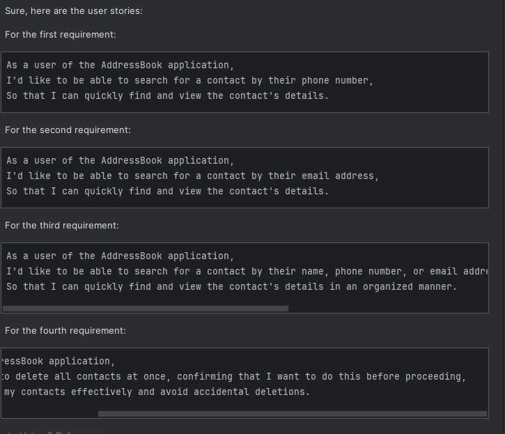
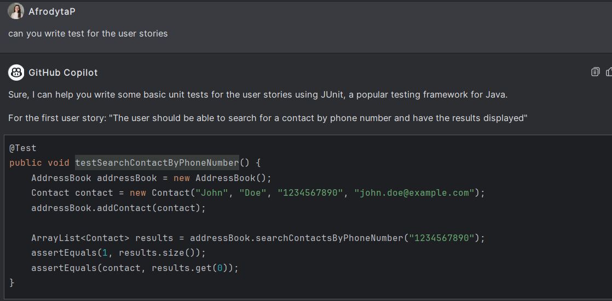
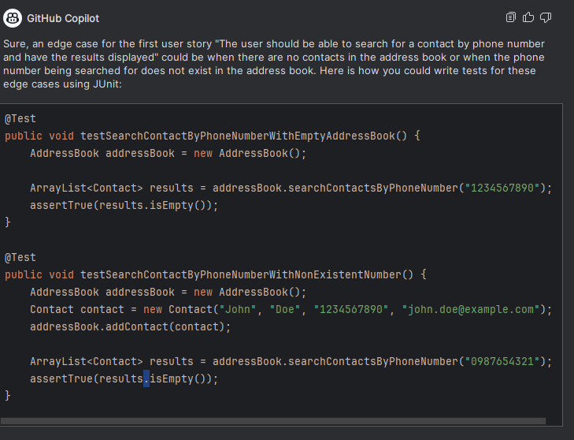
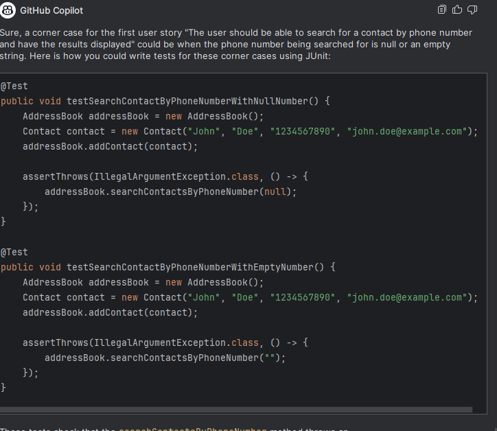
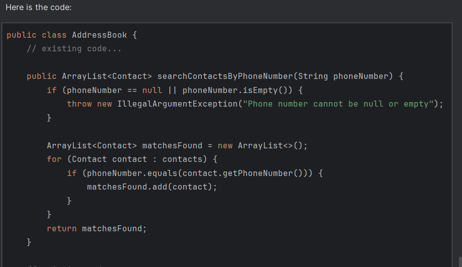
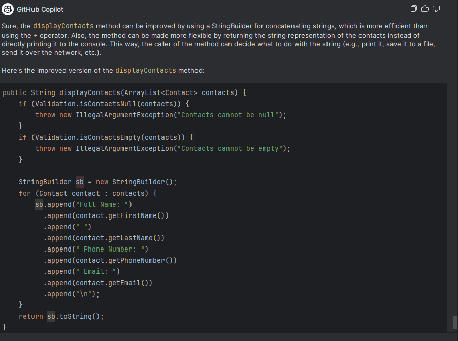
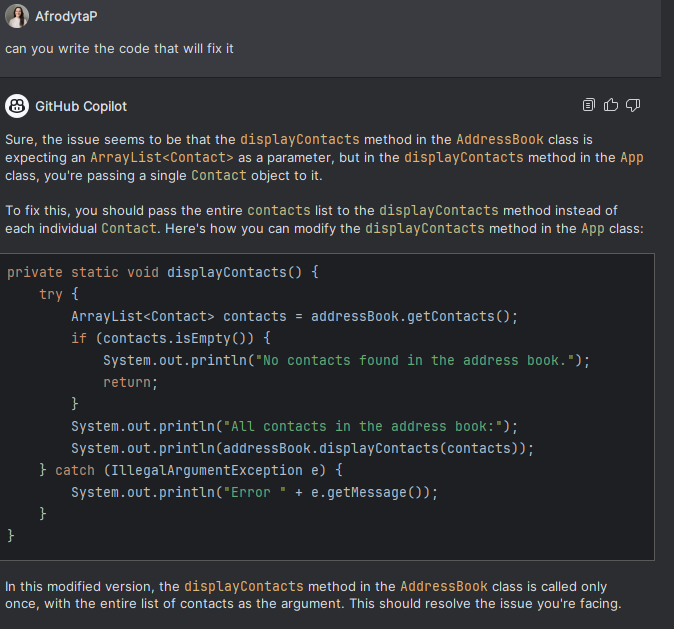
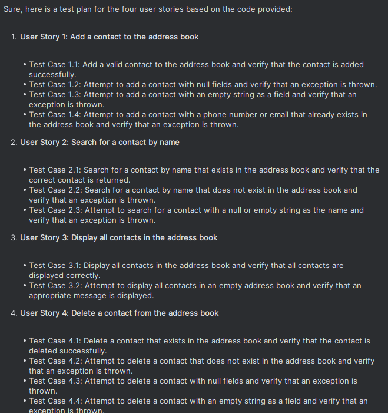

### Using Copilot to generate a user stories for Additional requirements:

### Using Copilot to generate a test for the stories for Additional requirements:
#### Test: generated by Copilot for Additional Requirement 1

#### Edge Case Test: generated by Copilot for Additional Requirement 1

#### Test Corner Case: generated by Copilot for Additional Requirement 1

#### Code generated by Copilot for Additional Requirement 1

### Refactoring my code with the use of Copilot

### Used Copilot to Debug my code

### Used Copilot to generate documentation for my code

## Test Plan for the Address Book Requirements this was generated by Copilot

### User Story 1: Add a contact to the address book
Test Case 1.1: Add a valid contact to the address book and verify that the contact is added successfully.

Test Case 1.2: Attempt to add a contact with null fields and verify that an exception is thrown.

Test Case 1.3: Attempt to add a contact with an empty string as a field and verify that an exception is thrown.

Test Case 1.4: Attempt to add a contact with a phone number or email that already exists in the address book and verify that an exception is thrown.
### User Story 2: Search for a contact by name
Test Case 2.1: Search for a contact by name that exists in the address book and verify that the correct contact is returned.

Test Case 2.2: Search for a contact by name that does not exist in the address book and verify that an exception is thrown.

Test Case 2.3: Attempt to search for a contact with a null or empty string as the name and verify that an exception is thrown.

### User Story 3: Display all contacts in the address book
Test Case 3.1: Display all contacts in the address book and verify that all contacts are displayed correctly.

Test Case 3.2: Attempt to display all contacts in an empty address book and verify that an appropriate message is displayed.
### User Story 4: Delete a contact from the address book
Test Case 4.1: Delete a contact that exists in the address book and verify that the contact is deleted successfully.

Test Case 4.2: Attempt to delete a contact that does not exist in the address book and verify that an exception is thrown.

Test Case 4.3: Attempt to delete a contact with null fields and verify that an exception is thrown.

Test Case 4.4: Attempt to delete a contact with an empty string as a field and verify that an exception is thrown.

Please note that this is a high-level test plan. The actual implementation of these test cases would depend on the testing framework you are using (like JUnit for Java).