## Kanban board of user story of requirements:
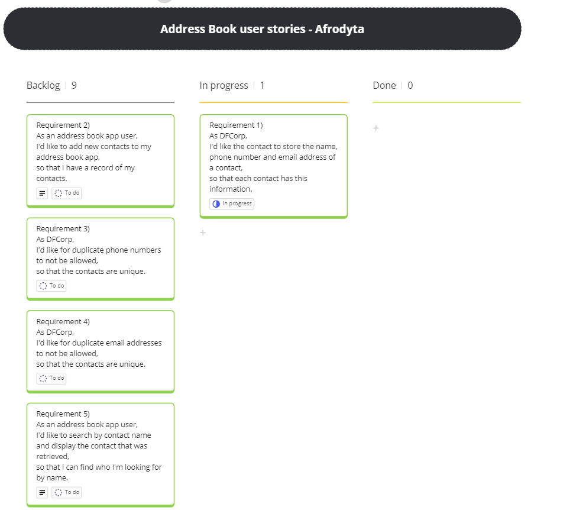
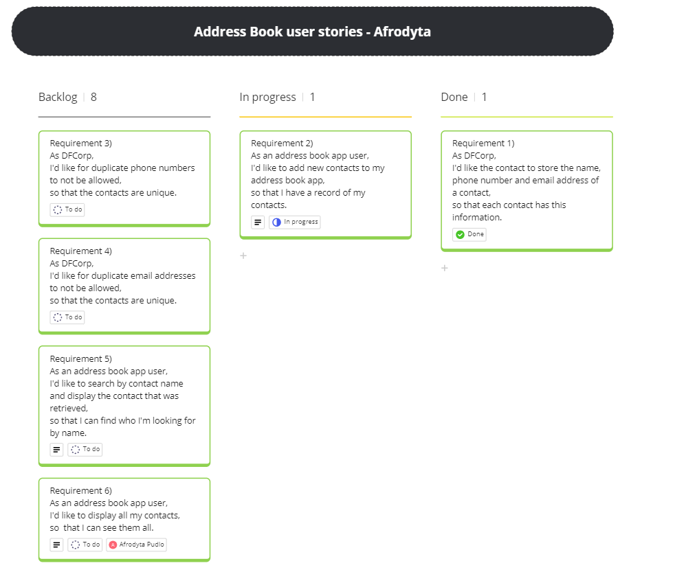
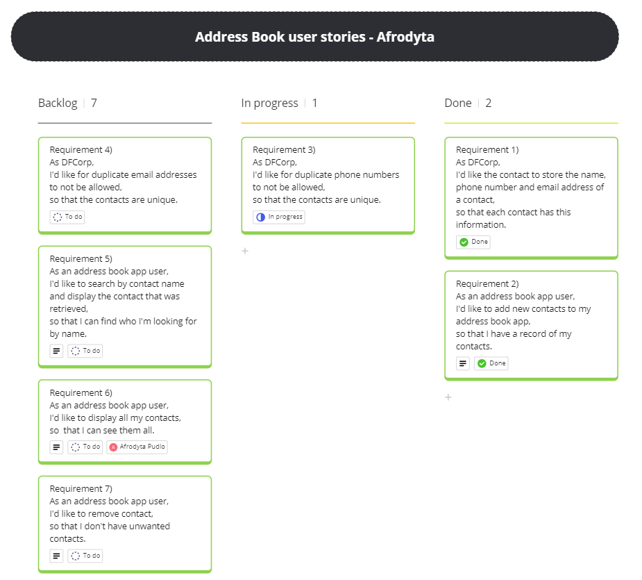
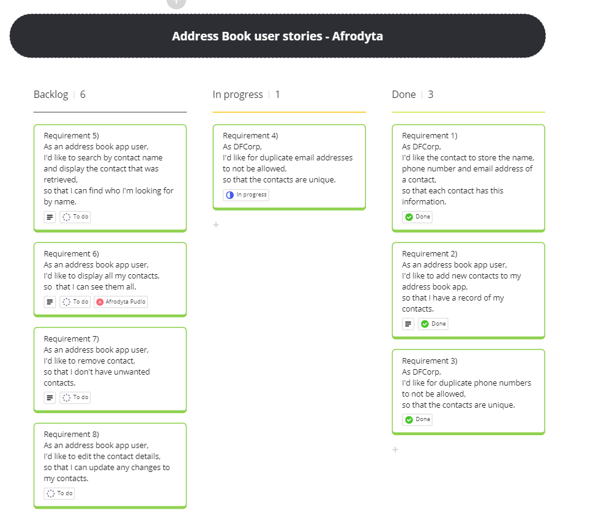
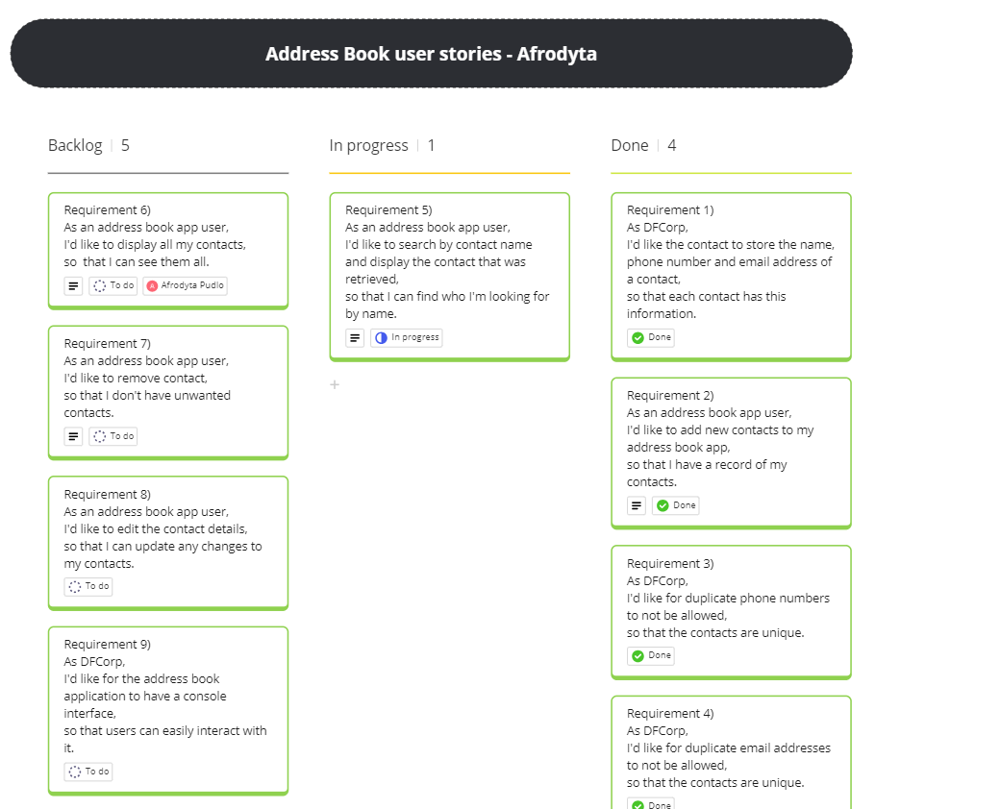
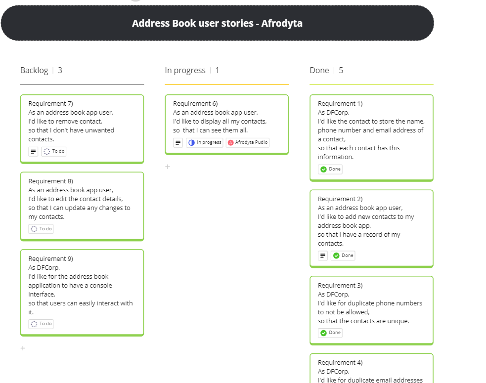
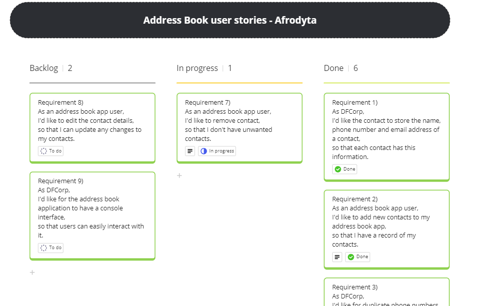
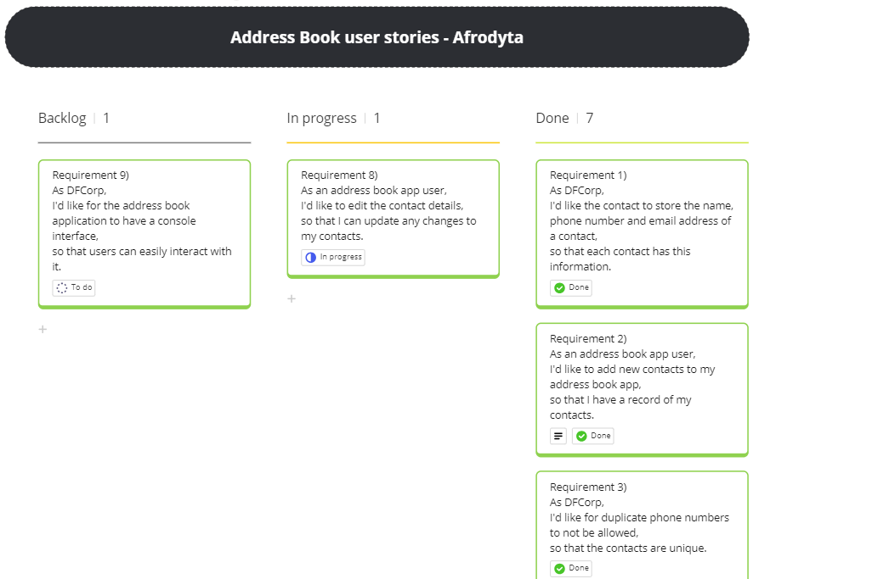
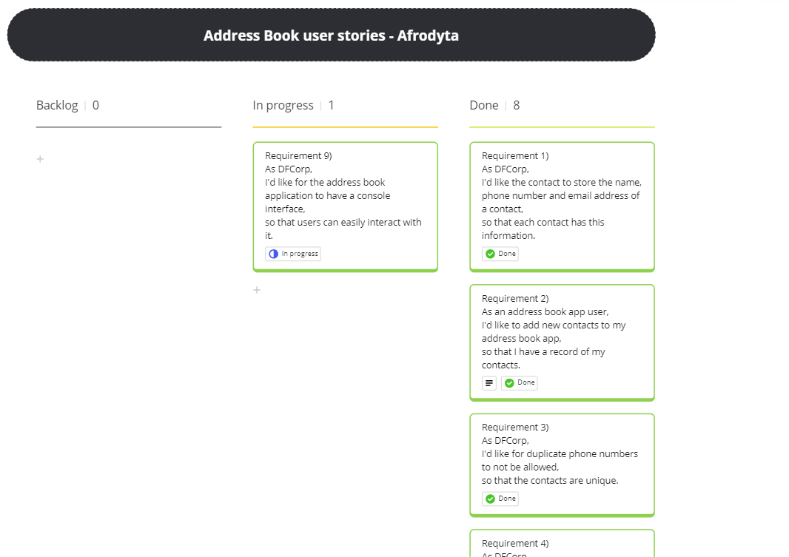
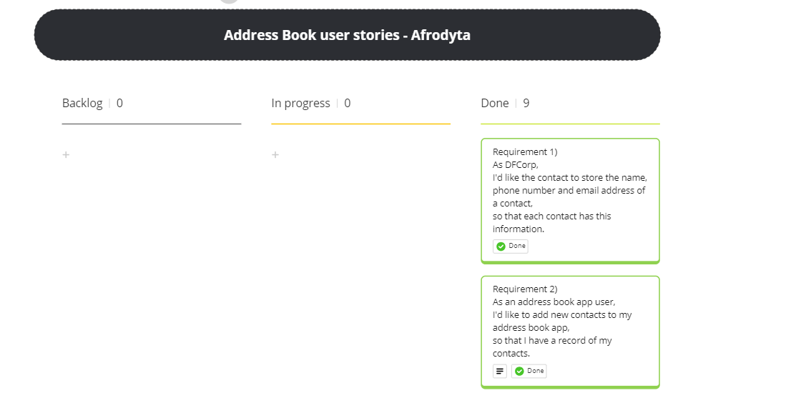

# Class Diagrams
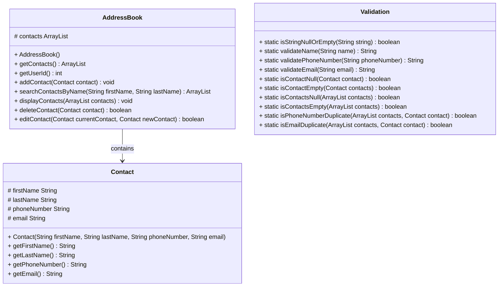
## Test Plan

#### Test Cases: contact constructor: 
- Requirement 1 - Test 1) Tests the contact constructor sets values when valid
- Requirement 1 - Test 2) Tests the isStringNullOrEmpty() return true when null input
- Requirement 1 - Test 3) Tests the isStringNullOrEmpty() return true when input is empty
- Requirement 1 - Test 4) Tests the isStringNullOrEmpty() return false when input is valid
- Requirement 1 - Test 5) Tests the validateName() throws Exception when input is not valid
- Requirement 1 - Test 6) Tests the validateName() returns Exception message when input is not valid
- Requirement 1 - Test 7) Tests the validateName() returns Exception message when input is not valid
- Requirement 1 - Test 8) Tests the validateName() returns name when input is valid
- Requirement 1 - Test 9) Tests the validatePhoneNumber() returns Exception message when input is not valid
- Requirement 1 - Test 10) Tests the validatePhoneNumber() returns Exception message when input is not valid
- Requirement 1 - Test 11) Tests the validatePhoneNumber() returns phoneNumber String when input is valid
- Requirement 1 - Test 12) Tests the validateEmail() returns Exception message when input is not valid
- Requirement 1 - Test 13) Tests the validateEmail() returns Exception message when input is not valid
- Requirement 1 - Test 14) Tests the validateEmail() returns email when input is valid
- Requirement 1 - Test 15) Tests the contact constructor sets values when valid

#### Test Cases: addContact():
- Requirement 2 - Test 1) Tests the addressBook constructor sets values when valid"
- Requirement 2 - Test 3) Tests the addContact() throw IllegalArgumentException when contact is null
- Requirement 2 - Test 4) Tests the addContact() contacts length increase by 1 when contact is added
- Requirement 2 - Test 5) Tests the addContact() adds given contact object to the Contacts array
- Requirement 2 - Test 6) Tests the addContact() does not add contact to Contacts array when contact is null

#### Test Cases: duplicatePhoneNumber():
- Requirement 3 - Test 1) Tests the addContact() dose not add given duplicate contact.getPhoneNumber object to the Contacts array

#### Test Cases: duplicateEmail():
Requirement 4 - Test 1) Tests the addContact() does not add given duplicate contact.getEmail object to the Contacts array

#### Test Cases: searchContactsByName():
- Requirement 5 - Test 1) Tests the searchContactsByName() returns a list of contacts with matching first and last names
- Requirement 5 - Test 2) Tests the searchContactsByName() returns an exception when no matches are found
- Requirement 5 - Test 3) Tests the searchContactsByName() returns a list of contacts with matching first and last names
- Requirement 5 - Test 4) Tests the searchContactsByName() throws an exception when first name is null"
- Requirement 5 - Test 5) Tests the searchContactsByName() throws an exception when last name is empty

#### Test Cases: displayContacts():
- Requirement 6 - Test 1) Tests the isContactsNull() return true and throws IllegalArgumentException when contacts is null
- Requirement 6 - Test 2) Tests the isContactsNull() return false when contacts are Valid
- Requirement 6 - Test 3) Tests the isContactsEmpty() return true when contacts are empty
- Requirement 6 - Test 4) Tests the isContactsEmpty() return false when contacts are not empty
- Requirement 6 - Test 5) Tests the displayContacts() prints out given contacts in the address book
- Requirement 6 - Test 6) Tests the displayContacts() throws an exception when contacts are null
- Requirement 6 - Test 7) Tests the displayContacts() throws an exception when contacts are empty
- Requirement 6 - Test 8) Tests the displayContacts() prints out contacts from searchContactsByName()

#### Test Cases: deleteContact():
- Requirement 7 - Test 1) Tests the deletesContact() throws an exception when contact are null
- Requirement 7 - Test 2) Tests the isContactEmpty() return true when contact is empty
- Requirement 7 - Test 3) Tests the isContactEmpty() return false when contact is not empty
- Requirement 7 - Test 4) Tests the deletesContact() throws an exception when contact are empty
- Requirement 7 - Test 5) Tests the deletesContact() throws an exception when contact is not in the address book
- Requirement 7 - Test 6) Tests the deletesContact() removes contact from the address book when contact is in the address book
- Requirement 7 - Test 7) Tests the deletesContact() returns true when contact is deleted

#### Test Cases: editContact():
- Requirement 8 - Test 1) Tests the editContact() throws an exception when contact is null
- Requirement 8 - Test 2) Tests the editContact() throws an exception when contact is empty
- Requirement 8 - Test 3) Tests the editContact() throws an exception when contact is not in the address book
- Requirement 8 - Test 4) Tests the editContact() if input is valid contact is edited and returns true
- Requirement 8 - Test 5) Tests the editContact() checks if contact is replaced with newContact

# Test Cases: App:

